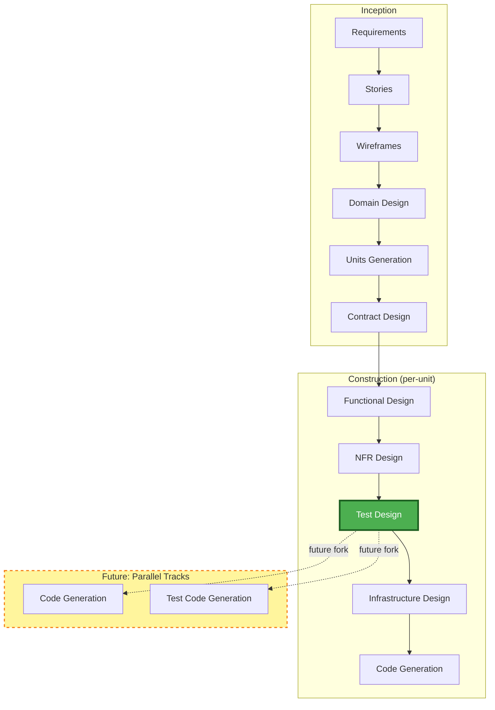

# Future Test Workflow — Parallel Tracks

## Vision

Test-design produces a single English-language test specification. Today, code-generation consumes it as acceptance criteria. In the future, the workflow forks after test-design into two parallel tracks:

1. **Code Generation Track** — AI writes production code guided by the test spec
2. **Test Code Generation Track** — AI (or QA team) writes independent verification code guided by the same test spec

Both tracks work against the same contract. Integration happens at deployment when the independently-written test code runs against the independently-written production code.

## Diagram

## Why this matters

- **Independent verification** — the test code is written by a different agent/team than the production code. Neither knows the other's implementation. Bugs are caught by the mismatch.
- **AI-native but org-compatible** — organisations with QA sign-off processes get their artifact (test plan) and their independent test execution. No process change required.
- **Same spec, two outputs** — the test-design document is the stable contract. Whether humans or AI consume it doesn't change the artifact.
- **Transition path** — today it's linear (test-design → code-gen). Tomorrow it forks. The test-design stage doesn't change — only what happens after it.
